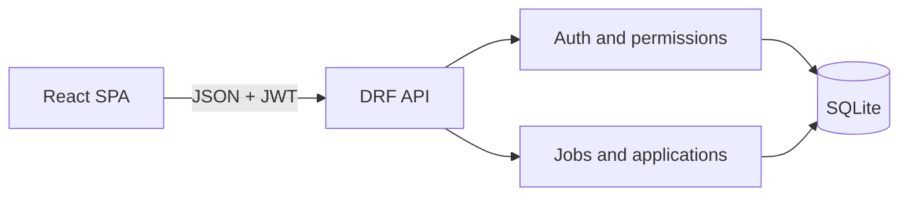

# Screenwise — Candidate Screening Platform

Screenwise is a full-stack recruiting workflow built for the Python Full-Stack Developer Assessment. Recruiters can manage jobs and candidate pipelines; candidates can discover open roles, apply with a resume URL, and track each application.

## Technology

- Backend: Django 5.2.7, Django REST Framework, Simple JWT
- Frontend: React, Vite, responsive CSS
- Database: SQLite (portable assessment setup)
- Testing: Django REST Framework API test client

## Features

### Recruiter

- Register and sign in with a recruiter account
- Create, list, edit, and close owned jobs
- View applicant totals per job
- Review candidate names, email addresses, and resume links
- Move applicants through Applied, Reviewing, Shortlisted, Rejected, and Hired states
- Ownership checks prevent recruiters from changing another recruiter's jobs or applications

### Candidate

- Register and sign in with a candidate account
- Browse only open jobs
- Submit a resume URL and optional cover letter
- Apply only once to each job
- Track application status in a personal dashboard

### Engineering safeguards

- JWT authentication and role-based authorization
- Server-side URL and required-field validation
- Database uniqueness constraint for duplicate applications
- Closed-job validation
- Responsive desktop/mobile interface
- Automated tests for core permissions and workflows
- Demo-data command for fast review

## Architecture



The frontend is a single-page React application. A small request layer sends JSON to REST endpoints and attaches JWT access tokens. DRF serializers validate payloads, permission classes enforce roles, views enforce object ownership, and Django models preserve relational integrity.

## Data model

- `User`: Django user plus `RECRUITER` or `CANDIDATE` role
- `Job`: owned by one recruiter; status is `OPEN` or `CLOSED`
- `Application`: joins one candidate to one job and stores resume URL, cover letter, and pipeline status

The `(job, candidate)` pair has a database-level unique constraint.

## Docker setup (recommended)

Requirements: Docker and Docker Compose.

```bash
docker compose up --build
```

That single command builds both images, runs migrations, seeds demo data, and starts both services.

- Frontend: http://localhost:5173
- Backend API: http://localhost:8000/api

To stop:

```bash
docker compose down
```

Demo accounts:

| Role | Username | Password |
| --- | --- | --- |
| Recruiter | `recruiter_demo` | `DemoPass123!` |
| Candidate | `candidate_demo` | `DemoPass123!` |

## Local setup

Requirements: Python 3.11+ and Node.js 20+.

```bash
python -m venv .venv
source .venv/bin/activate
pip install -r requirements.txt
python manage.py migrate
python manage.py seed_demo
python manage.py runserver
```

In a second terminal:

```bash
cd frontend
npm install
npm run dev
```

Open `http://localhost:5173`.

Demo accounts:

| Role | Username | Password |
| --- | --- | --- |
| Recruiter | `recruiter_demo` | `DemoPass123!` |
| Candidate | `candidate_demo` | `DemoPass123!` |

## Tests and build

```bash
python manage.py test
cd frontend && npm run build
```

## API endpoints

| Method | Endpoint | Access | Purpose |
| --- | --- | --- | --- |
| POST | `/api/auth/register/` | Public | Create account and return JWT |
| POST | `/api/auth/login/` | Public | Obtain JWT pair |
| GET | `/api/auth/me/` | Authenticated | Current profile |
| GET | `/api/jobs/` | Public/authenticated | Open jobs or recruiter's jobs |
| POST | `/api/jobs/` | Recruiter | Create job |
| GET/PUT | `/api/jobs/{id}/` | Public/owner | View or edit job |
| PATCH | `/api/jobs/{id}/close/` | Recruiter owner | Close job |
| POST | `/api/jobs/{id}/apply/` | Candidate | Apply to job |
| GET | `/api/applications/` | Authenticated | Role-scoped application list |
| PATCH | `/api/applications/{id}/status/` | Recruiter owner | Update pipeline status |

## Trade-offs and next steps

SQLite keeps evaluation setup friction low. A production deployment should use PostgreSQL, environment-based secrets, HTTPS, refresh-token rotation, pagination, filtering, audit history, and object storage for uploaded resumes. Email notifications and recruiter notes are natural next iterations.

## Assessment notes

The most challenging part was keeping one API intuitive for two roles while preventing cross-account data access. This is handled at three layers: role permission classes, filtered querysets, and explicit ownership checks. Application uniqueness is also enforced both in the API and database.

